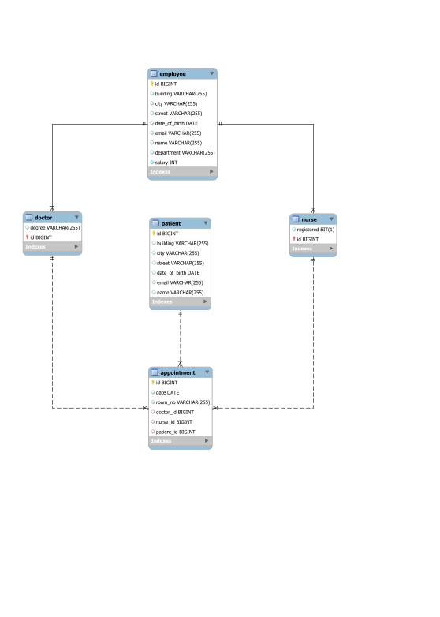

# medical-appointments-api

A REST API application for medical appointments using Spring Boot and Hibernate.

### REST Endpoints:

#### Doctor

#### GET
- /api/doctor
- /api/doctor/async
- /api/doctor/{id}
- /api/doctor/{id}/async
#### POST
- /api/doctor/add
- /api/doctor/add/async

#### DELETE
- /api/doctor/delete/{id}
- /api/doctor/delete/{id}/async

> __Note:__
>
> The same endpoints for Nurse, Patient and Appointment

### Medical Database Schema

